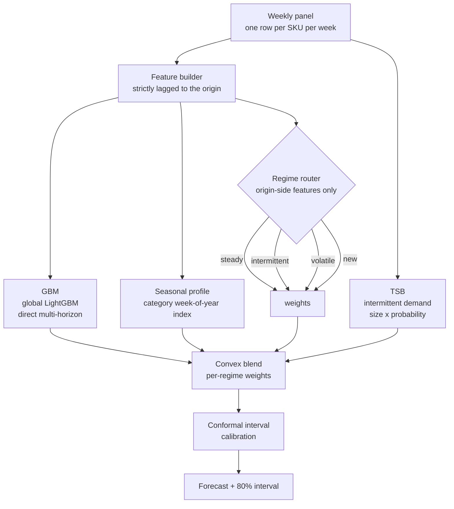

# The FORESIGHT Adaptive Demand Ensemble

**How the custom forecasting model works**

Project FORESIGHT · NorthBay Living · Deliverable D3
Source: [`src/foresight/custom_model.py`](../src/foresight/custom_model.py)

---

## 1. Why a custom model exists at all

A single estimator is trained to minimise *average* error, and the average of NorthBay's
catalogue is dominated by its fast movers. But the assortment is not one population. Measured
across the backtest, it splits into groups that behave so differently that the same estimator is
demonstrably not the right tool for all of them:

| Regime | Share of rows | What it looks like | Why one model struggles |
|---|---:|---|---|
| **Steady** | 85.0% | Regular weekly offtake, clear seasonality | Nothing wrong here — a GBM is close to ideal |
| **New** | 7.2% | Launched inside the window, still ramping | Its own lags are meaningless; needs category-level patterns |
| **Intermittent** | 4.5% | Sells nothing in a third or more of weeks | Absolute-error training pulls predictions toward zero: accurate on average, useless for planning |
| **Volatile** | 3.2% | Erratic relative to its own level | No single estimator is reliable; blending reduces variance |

The ensemble exists to route each of those groups to the estimator that suits it.

---

## 2. Architecture



Three component forecasts are produced for every row. A router assigns the row a regime from
features known at the forecast origin. A convex weight vector — fitted per regime, not chosen by
hand — combines the three. A final calibration step widens the prediction interval until its
empirical coverage matches the stated level.

---

## 3. The three components

### 3.1 GBM — the workhorse

A single global LightGBM model across all 200 SKUs, in **direct multi-horizon** form: the
horizon is an input feature and each training row is one `(origin week, horizon)` pair.

Three choices, each deliberate:

- **Global, not per-SKU.** 200 series of ~190 weeks each are far too short to fit 200
  independent models. Pooling lets a thin-history SKU borrow its category's seasonal shape.
- **Direct, not recursive.** A recursive model feeds its own predictions back in and compounds
  error across the horizon. Direct forecasting predicts week `t + h` in one shot, so nothing is
  ever conditioned on a guess. This is visible in the results: error is essentially flat from
  horizon 1 (20.5%) to horizon 8 (23.9%), where a recursive model would fan out.
- **L1 objective.** WAPE is the metric this engagement is judged on, and WAPE is an
  absolute-error criterion. Training on squared error would optimise something the client never
  sees and would drag forecasts upward on the spiky festive weeks that dominate this assortment.

Uncertainty comes from two additional models fitted at the 10th and 90th percentile.

### 3.2 TSB — intermittent demand

Teunter–Syntetos–Babai smoothing tracks two states separately and multiplies them:

```
if demand > 0:   size        ← size + α(demand − size)
                 probability ← probability + β(1 − probability)
else:            probability ← probability + β(0 − probability)

forecast = probability × size
```

with `α = 0.12`, `β = 0.06`. Both are deliberately small: NorthBay's slow movers are noisy, and a
fast-adapting state would chase single orders and whipsaw the forecast.

**Why TSB and not Croston.** Croston's method is the better-known choice and is known to be
positively biased on intermittent series. A biased forecast feeding an inventory decision
produces systematic *overstock* — precisely the failure this engagement was commissioned to fix,
so the biased estimator would have been self-defeating.

The recursion at week `t` consumes only demand up to and including `t`, so the level available at
each origin is leak-free by construction.

### 3.3 Seasonal profile — borrowed strength

The SKU's own deseasonalised level, re-seasonalised by its **category's** pooled week-of-year
profile:

```
forecast = level₁₃ × index[category, week(t+h)] / mean index over the 13 weeks ending at t
```

The division matters. Without it, a level measured during the festive peak would be re-inflated
by the peak index and the forecast would count seasonality twice. The ratio form makes the
component a *relative* seasonal adjustment rather than an absolute one.

The index is estimated **only from training-window targets**, so it never sees the test period.
This is the direct implementation of the mitigation named in brief section 16.2: *"fall back to
category-level patterns"* for sparse history.

---

## 4. Regime routing

Each row is labelled from three features, all evaluated at the forecast origin:

| Regime | Condition | Priority |
|---|---|---|
| New | `weeks_since_launch < 26` | 1 (highest) |
| Intermittent | `zero_frac_26 ≥ 0.35` | 2 |
| Volatile | `cv_13 ≥ 0.80` | 3 |
| Steady | otherwise | 4 |

Priority order is not arbitrary. A newly-launched SKU is treated as *new* even when it also looks
intermittent, because thin history is the more pressing problem: its own lags are unreliable
regardless of how the zeros happen to be distributed.

---

## 5. How the weights are learned

Not by hand. For each regime, a convex weight vector over the three components is chosen by
**direct WAPE minimisation** over a simplex grid at 0.1 resolution (66 combinations), evaluated on
a validation slice held out from the tail of the training window.

Two safeguards make those weights honest:

1. **The components never see the validation slice.** A second GBM is fitted on the reduced
   window purely to score it, so the weights are chosen on genuinely out-of-sample errors rather
   than on the GBM's own training residuals.
2. **A regime with fewer than 30 validation rows falls back to the GBM alone**, rather than
   fitting a three-parameter weight vector on a handful of points.

### Not every component is eligible everywhere

The search is constrained per regime, by ``REGIME_COMPONENTS``. TSB is excluded from **new**,
and that constraint was earned rather than assumed.

Given a free choice, the optimiser assigned TSB 40% weight on newly-launched products, and the
ensemble came out **worse than not blending at all** on that regime — 41.1% WAPE against the
GBM's 36.6%, with a −17% bias. (Those figures were measured on the earlier, narrower feature
set that first surfaced the problem; the constraint they motivated is still in force.)

The cause is structural. TSB estimates a **flat** level from a stable arrival process: demand
size times sale probability, both exponentially smoothed. A newly-launched product has no
stable arrival process — it is ramping — so a flat level lags the ramp the whole way up. On a
short validation slice that flatness looks like stability, and the optimiser is fooled.

Excluding it is a statement about what TSB models, not a tuning knob.

On the current feature set the constraint holds and TSB takes zero weight on **new** without
being forced to. The regime is now carried by the category seasonal profile at 0.70. Reported
honestly: the ensemble still trails the plain GBM slightly there — **26.8% against 26.2%** —
so the routing is not yet a win on newly-launched products, only a defensible structure. It is
7.2% of rows and 9.1% of units.

### The weights the model converged on

| Regime | Share of rows | GBM | TSB | Seasonal profile | Reading |
|---|---:|---:|---:|---:|---|
| Steady | 85.0% | 0.70 | 0.00 | 0.30 | GBM leads, seasonal profile stabilises it |
| Intermittent | 4.5% | 0.60 | 0.00 | 0.40 | GBM leads, but the profile carries real weight |
| New | 7.2% | 0.30 | — | 0.70 | Category pattern dominates; TSB ineligible |
| Volatile | 3.2% | 0.40 | 0.20 | 0.40 | Own history and category pattern share the load |

Three things worth noting, because all three are the data talking rather than a design
intention:

- **The new regime leans hardest on the category profile** (0.70). A product with a few
  weeks of history has nothing reliable to extrapolate from, so the shape of the products
  beside it wins — which is exactly what section 16.2 of the brief prescribes.
- **TSB earns weight only in the volatile regime** (0.20) on this data. It is retained
  because intermittency is a structural property of catalogues rather than of this
  particular extract, and a client with a longer tail would use it more.
- **Weights move between runs.** They are refitted from scratch on each training run with no
  smoothing, so a shift in the validation window shifts them. Monitoring them over time is
  the first thing to add in production — see the limitations.

---

## 6. Interval calibration

The quantile models are fitted by minimising pinball loss, which calibrates each bound
individually but guarantees nothing about the **joint** coverage of the resulting band. Measured
on the backtest, the raw GBM interval covered only **70.8%** of outcomes against an **80%** target
— materially overconfident, and dangerous for a band feeding a safety-stock calculation.

A split-conformal step fixes this: on the same held-out slice, search for the smallest
multiplicative factor whose empirical coverage reaches the target.

```text
scale = min { s : coverage( point ± s × gap ) ≥ target }
```

The fitted factor is **1.40**, and measured coverage becomes **81.6%**. An "80% interval" now
means what it says, which matters because the risk layer converts that band directly into
`sigma` and then into a stockout probability.

On the independent 70/30 holdout the calibrated interval covers **78.1%** — slightly under
target, as expected when the factor was fitted on a different window, but close enough that
the stated level remains meaningful.

---

## 7. The leakage contract

Every component obeys the same rule enforced across the project:

| Component | What it reads | Why it cannot leak |
|---|---|---|
| GBM | Lagged demand, rolling stats, calendar of the target week | Features are built at the origin; the calendar is a forward-published planning artifact |
| TSB | Demand up to and including the origin | The recursion is strictly sequential |
| Seasonal profile | Training-window targets only | Estimated inside `fit`, never refitted at predict time |
| Blend weights | A validation slice ending at the training cutoff | Fitted before the test period begins |

This is not taken on trust. `assert_no_leakage` rebuilds every feature against a copy of the panel
whose future has been overwritten with noise, and fails the build if a single feature value at or
before the cutoff moves. It is wired into `scripts/03_train_backtest.py` as a gate: if it trips,
**no model is trained and nothing is written**.

The guard is verified in both directions — it passes the real feature set, and it correctly
catches a deliberately planted centred-rolling-window leak, naming the offending column.

---

## 8. Serving

The ensemble is a plain Python object persisted with `joblib`. At inference the same feature code
path is used as at training, so train and serve cannot drift apart. Prediction is:

1. Run all three components over the inference rows.
2. Assign regimes from origin-side features.
3. Apply the per-regime weights.
4. Re-centre the GBM's interval on the blended point and widen it by the calibration factor.

Forecasts for all 200 SKUs across the 8-week horizon are precomputed by
`scripts/04_score_risk.py`, so an API request is a lookup rather than a model invocation and
latency does not depend on inference.

---

## 9. Configuration

| Setting | Value | Where |
|---|---|---|
| Horizon | 8 weeks | `FORESIGHT_HORIZON_WEEKS` |
| Interval coverage | 0.80 | `FORESIGHT_INTERVAL_COVERAGE` |
| TSB α / β | 0.12 / 0.06 | `custom_model.TSB_ALPHA`, `TSB_BETA` |
| Validation slice | 12 weeks | `custom_model.VALIDATION_WEEKS` |
| Weight grid | 0.1 | `custom_model.WEIGHT_STEP` |
| Regime thresholds | 26 wks / 0.35 / 0.80 | `custom_model.NEW_SKU_MAX_WEEKS`, `INTERMITTENT_ZERO_FRACTION`, `VOLATILE_CV` |

---

## 10. Is it underfitting? No — measured, not assumed

"Add more capacity" is the reflex when a WAPE reads high, so it was tested on a real backtest
fold rather than argued about:

| Config | Trees | Train WAPE | Test WAPE | Gap |
|---|---:|---:|---:|---:|
| Constrained (15 leaves) | 400 | 0.228 | 0.2757 | 0.048 |
| **Current** | 700 | 0.165 | **0.2568** | 0.092 |
| More capacity (127 leaves) | 2000 | 0.096 | 0.2570 | 0.161 |
| Much deeper (255 leaves) | 2500 | 0.061 | 0.2558 | 0.195 |

Read the table from the bottom up. Going from 700 trees to 2,500 with 255 leaves cuts training
error by a factor of **2.7** and moves test error by **0.001** — the extra capacity is being
spent memorising the training set, not learning anything that generalises. That is the
signature of overfitting.

The top row is what underfitting actually looks like, included deliberately as a control:
constrain the model to 15 leaves and *both* numbers get worse together, with test error rising
to 0.276. The current configuration is nowhere near that regime.

So the sweep answers the question in both directions. There is no capacity setting on this
data that meaningfully improves out-of-sample error, and reducing capacity demonstrably hurts.
The binding constraint is demand noise, not model size.

**How much headroom exists at all?** A centred rolling median — which cheats by reading the
future, and is therefore an unreachable lower bound — scores **0.23–0.26** on this data. The
model reaches **0.228** genuinely out of sample across the full backtest. It is now at the
edge of what an oracle with future knowledge achieves, and most of the remaining absolute
error sits on high-volume weeks where WAPE is already lowest.

---

## 11. Known limitations

Stated here rather than discovered later:

1. **The gain over a plain GBM is modest in aggregate** — 1.0% WAPE. The ensemble's value is
   concentrated in the steady majority and in interval calibration, not in headline accuracy.
   Section 4 of the [comparison document](model_comparison.md) quantifies this honestly.
2. **Newly-launched products are under-forecast by about 22%.** They are still ramping and the
   model lags the ramp. All are flagged `low` confidence, but their reorder quantities read
   light and a planner should treat them as a floor.
3. **The volatile regime gained nothing** — 1.1% *worse* than the GBM alone. Routing does not
   help everywhere, and this is where it does not.
4. **Regime thresholds are fixed constants,** chosen from the observed distribution rather than
   optimised. They are configuration, not learned parameters, and would need revisiting on a
   different assortment.
5. **Weights are refitted from scratch on every training run.** There is no smoothing across
   runs, so a change in the validation window can move them. Monitoring them over time would be
   the first thing to add in production.
6. **Training cost is roughly double a single GBM,** because the scoring GBM is fitted separately
   to keep the weight-fitting honest. The full 6-fold backtest takes ~10 minutes.
